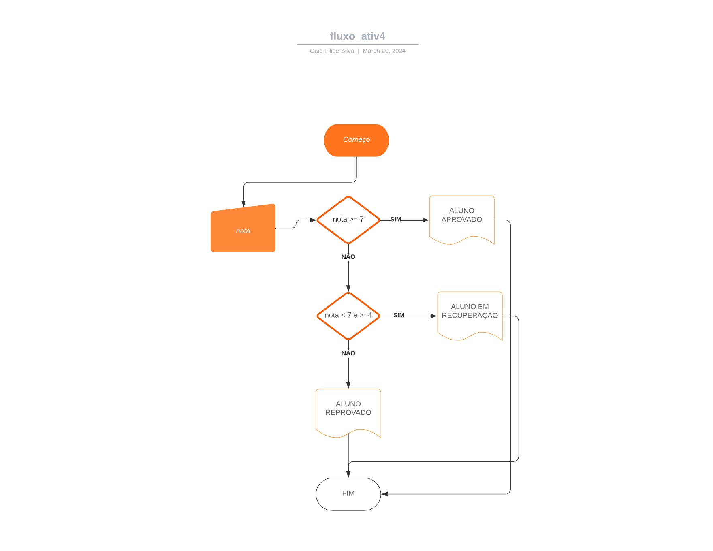
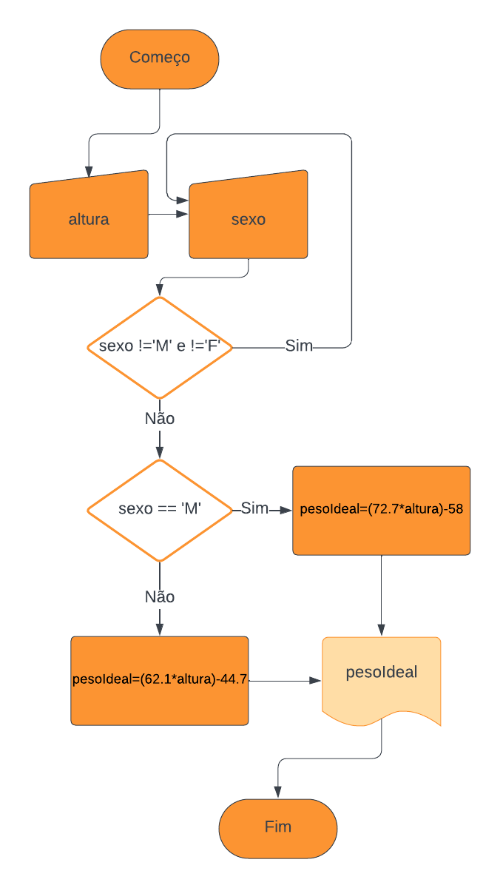
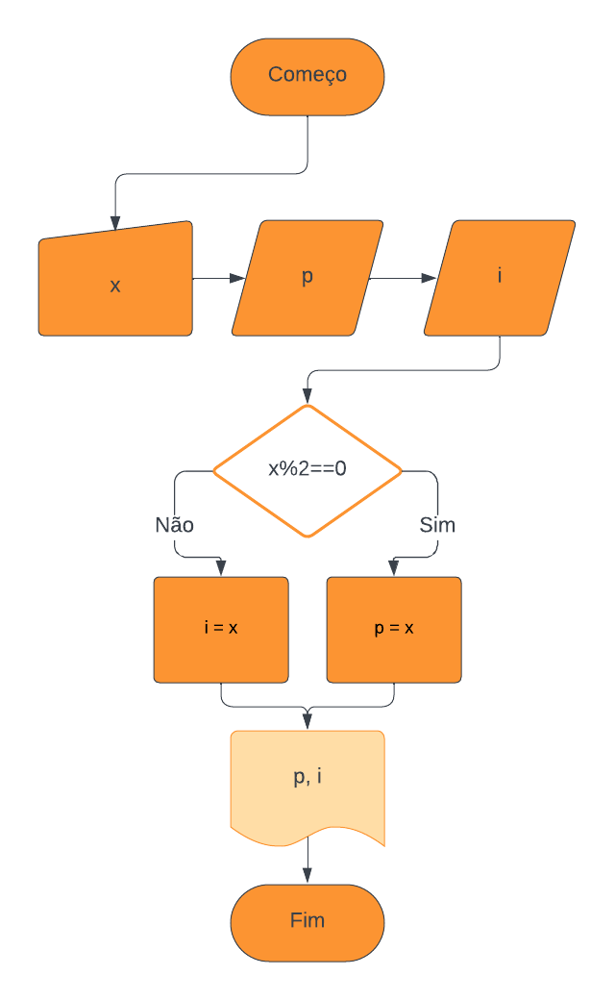
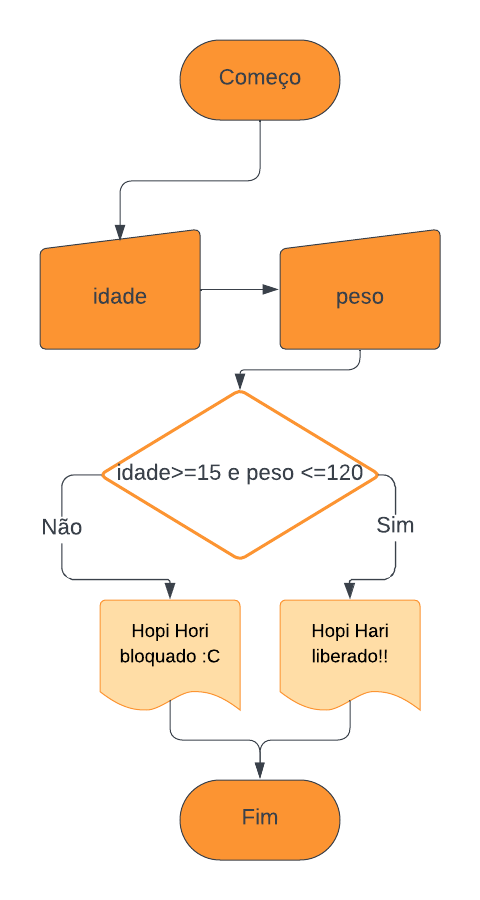
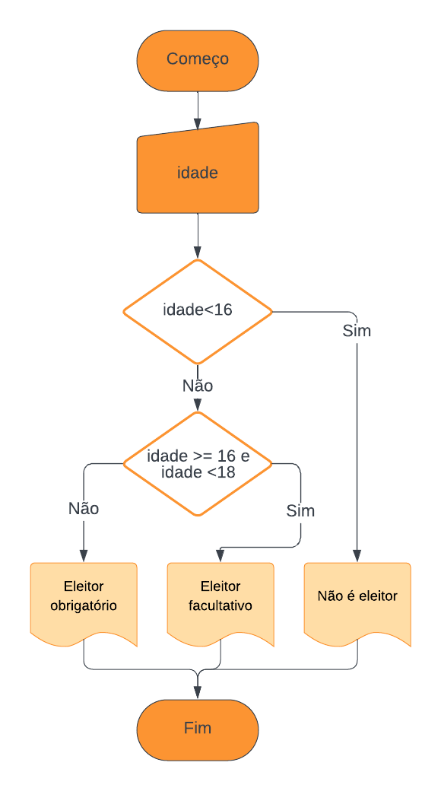
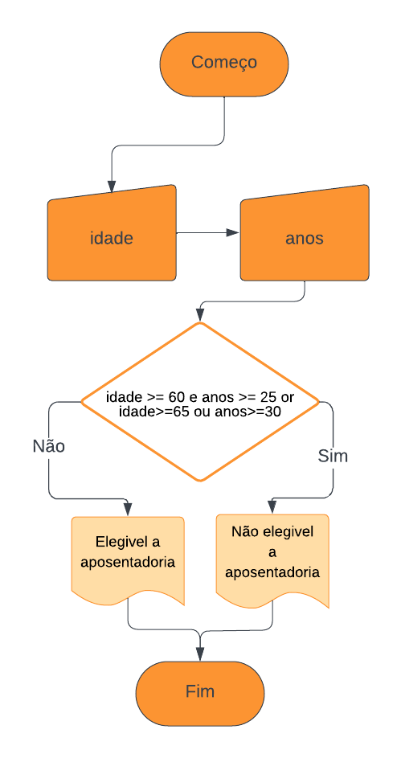
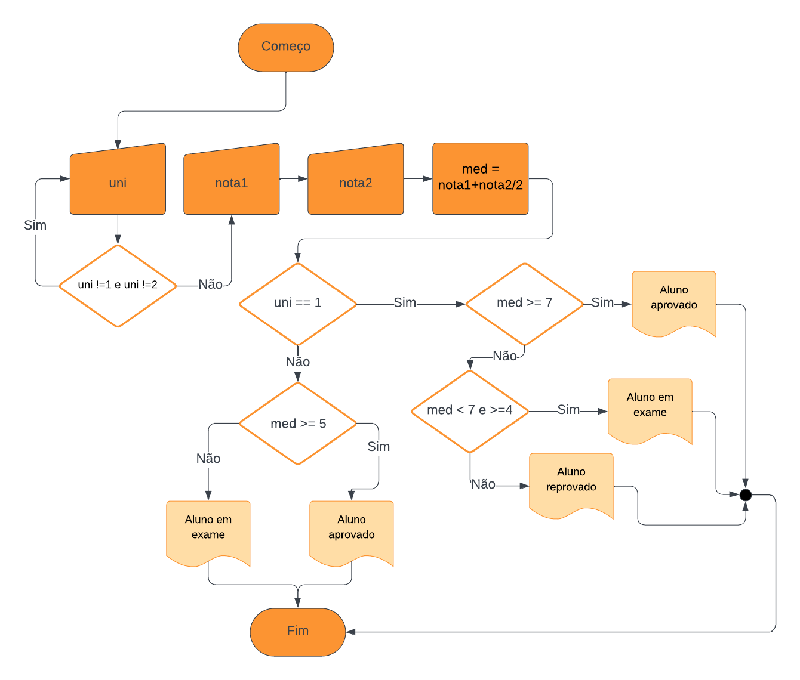

#Raciocinio Algoritmico 

Atividade de operações condicionais realizada em sala de aula no dia 20/03

##Fluxograma 4

##Fluxograma 5

##Fluxograma 6

##Fluxograma 7

##Fluxograma 8

##Fluxograma 9

##Fluxograma 10
